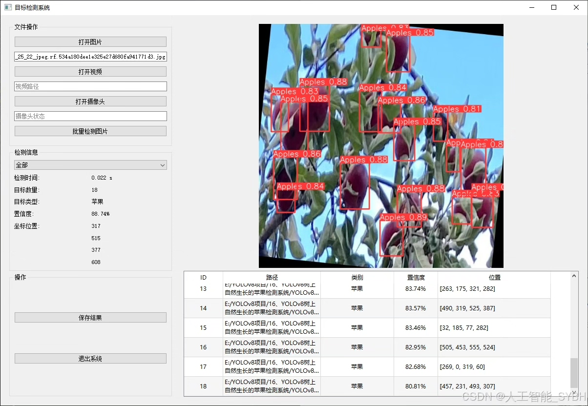
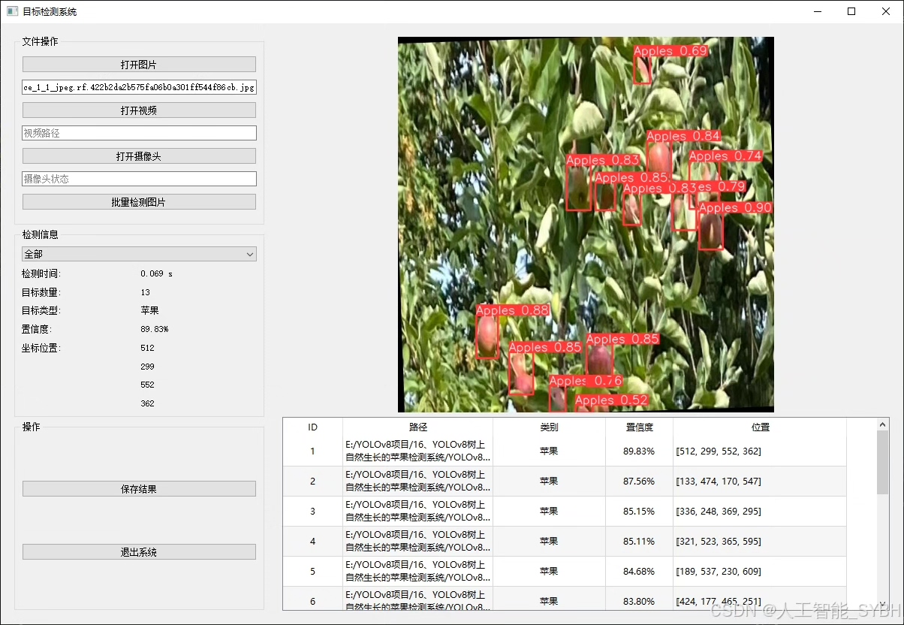
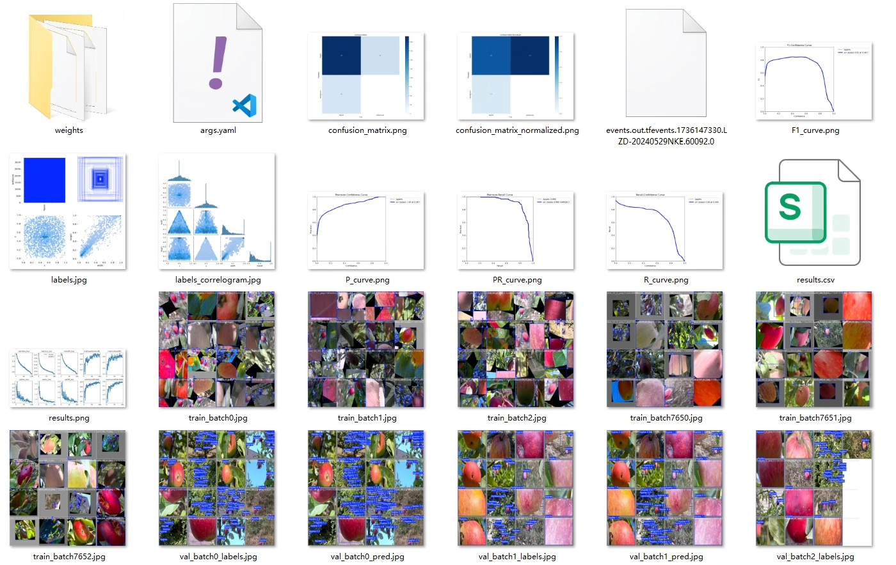
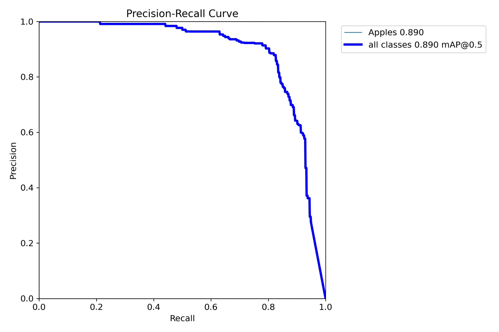
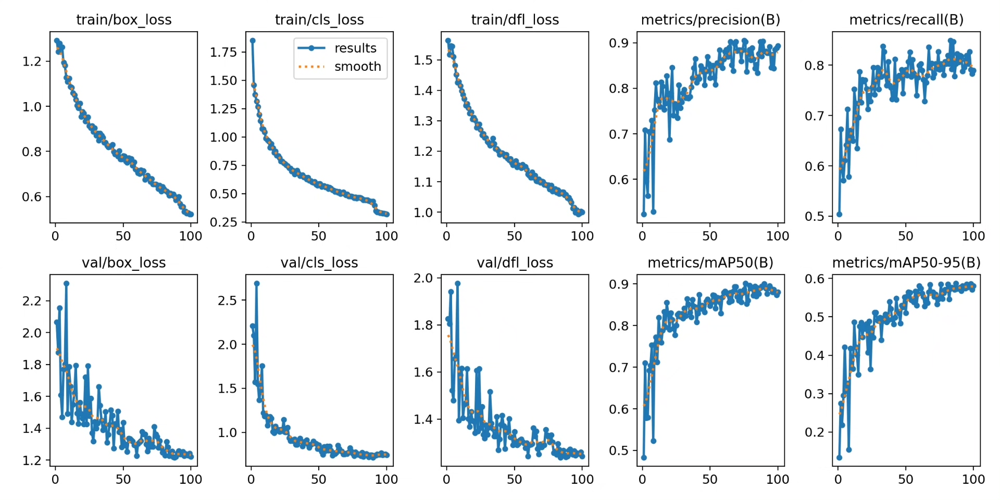
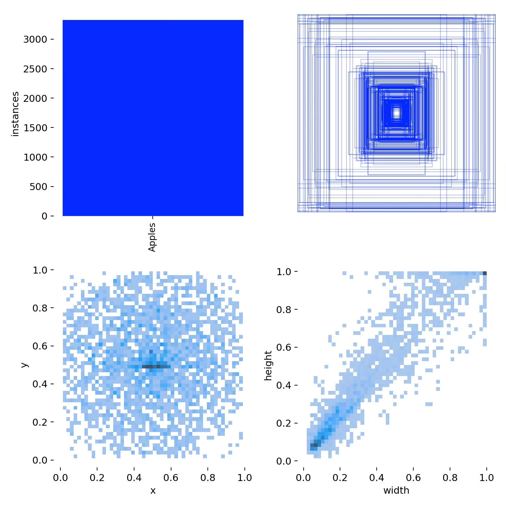
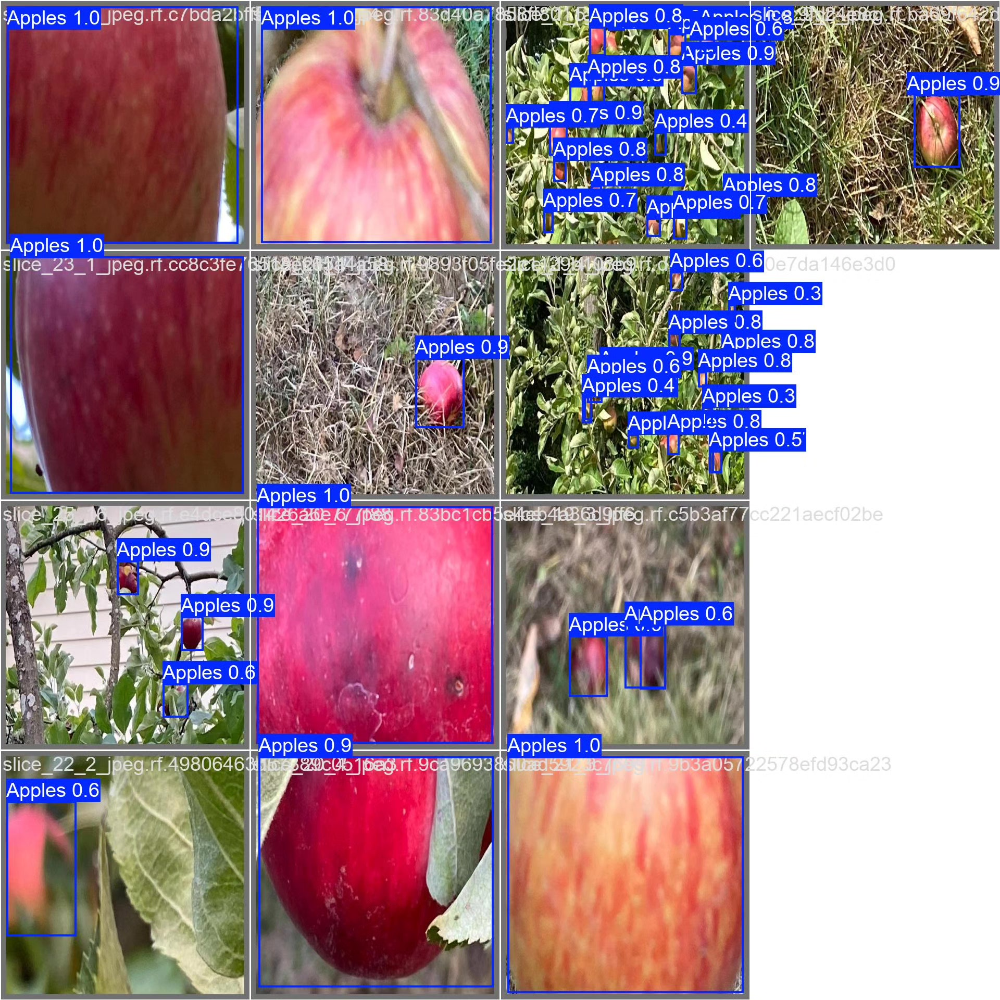
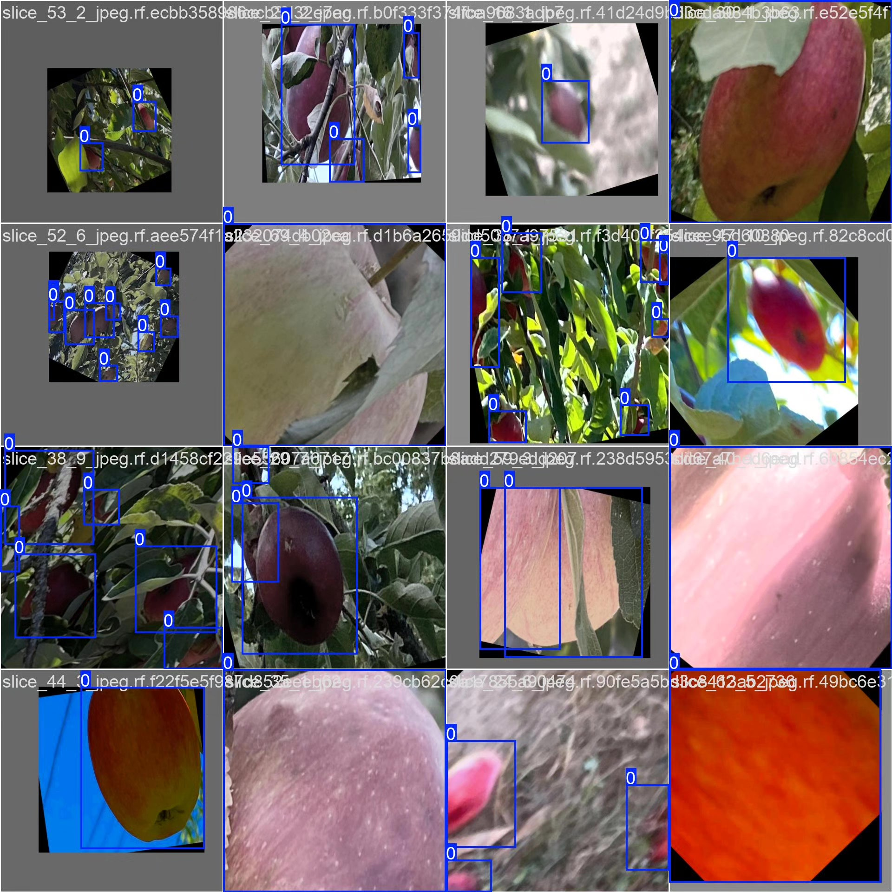

# Based on YOLOv8 deep learning, a system for detecting apples growing naturally on trees

## Body

This project is based on the advanced YOLOv8 computer vision technology to develop a smart system specifically for detecting apples growing naturally on trees. The system adopts a single-class detection mode ('Apples'), focusing on accurately identifying and positioning apple fruits in natural environments. The project has constructed a dataset containing 1471 high-quality images (1355 training set, 77 validation set, 39 test set), covering different growth stages, lighting conditions, and obstruction situations of apple images, ensuring that the model has strong generalization capabilities.

The company's products have obtained the official commercial license certification from YOLO.

We provide after-sales service:

After payment, we will provide WeChat IDs for instant questions and answers.

Environmental configuration: We will provide an instruction tutorial for environmental configuration, and WeChat provides Q&A services.

Remote installation service: If you need remote configuration, an additional fee of 69 is required, with all fees refunded if the configuration fails (only the installation fee is refunded for special old computers).

Retraining dataset: After setting up the environment, you can train on your own computer. If you need us to retrain, just pay 69 plus computing power fees (2.5 yuan/hour).

Full after-sales service

## Images

## Payment

Here is a pay link on Stripe ( https://buy.stripe.com/3cs8yP7sY87d0vu9AB ). Please contact me lonlonago@foxmail.com after funding $89, and I will send you a complete data files , thank you!

